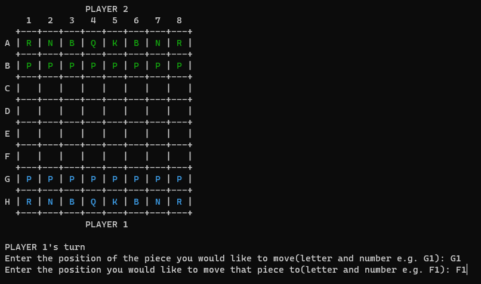
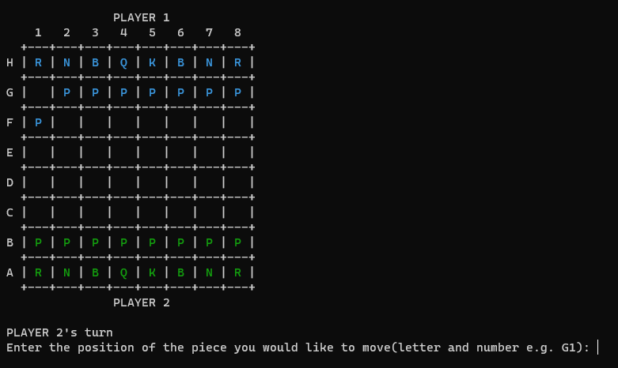

# Linux-Chess

*\`Chess, like any creative activity, can exist only through the combined efforts of those who have creative talent, and those who have the ability to organize their creative work` ~ Mikhail Botvinnik.*

Recently, my focus has been learning AWS (Amazon Web Services), and one of the most important operating system to know when using AWS is Linux. So as a personal challenge, I decided to develop an application exclusively utilizing Linux tools, including the Linux terminal for file creation, manipulation, and deletion, along with the use of the GNU nano text editor to edit files, even this entire chess application was built only using the BASH programming language.

This chess game was built to be played in the Linux terminal, and was designed to be played with a friend, however my plan also involves implementing a chess AI in the future to enable solo gameplay.

## To Play This Chess Game:
### 1. clone this repo
```
git clone https://github.com/AranMesquita/Linux-Chess.git
```
### 2. cd into to the directory that contains the game files
```
cd User/LINUX-CHESS/game-files
```
### 3. Run the game by using the command below
```
./chess.sh
```
### 4. After running './chess.sh', this should then pop-up


### 3. To play the game first enter the position(G1) of the piece you would like to play, then press enter, then enter position(F1) you would like to move the chess piece to, should look like the image below


### 4. After you Player 1's turn, the bored will swap sides, so Player 2 can play. After Player 2's turn, the board will swap back to Player 1's side

